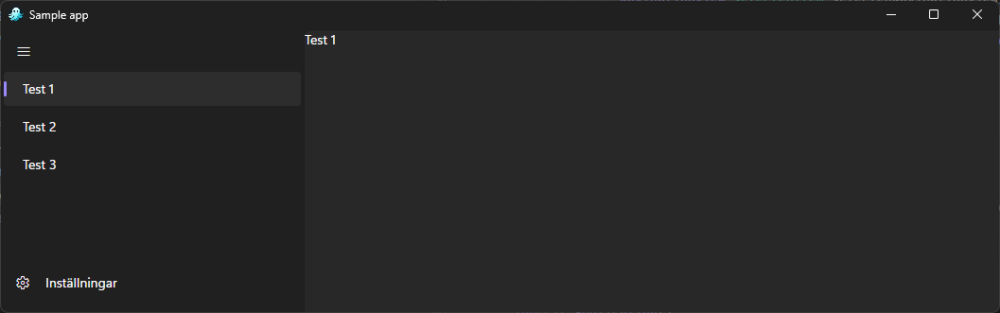

#  FluentAvalonia.FuncUI.Bindings

FluentAvalonia.FuncUI.Bindings is a library that integrates [FluentAvalonia](https://github.com/amwx/FluentAvalonia) with [Avalonia.FuncUI](https://github.com/fsprojects/Avalonia.FuncUI). It contains bindings that enable the use of FluentAvalonia's controls in an F# context offered by Avalonia.FuncUI. 

## Contributing

Please contribute to this project through issue reports, pull requests, code reviews, documentation and discussions.

This project is newly created and all help to develop it further is greatly appreciated. I would love to see this library grow to cover all of the FluentAvalonia controls.

## Sample application

For helping with development and testing, there is a sample application that demonstrates the usage of the library. Feel free to contribute to it as well!

## Star history

<a href="https://star-history.com/#matachi/FluentAvalonia.FuncUI.Bindings&Date">
 <picture>
   <source media="(prefers-color-scheme: dark)" srcset="https://api.star-history.com/svg?repos=matachi/FluentAvalonia.FuncUI.Bindings&type=Date&theme=dark" />
   <source media="(prefers-color-scheme: light)" srcset="https://api.star-history.com/svg?repos=matachi/FluentAvalonia.FuncUI.Bindings&type=Date" />
   
 </picture>
</a>
